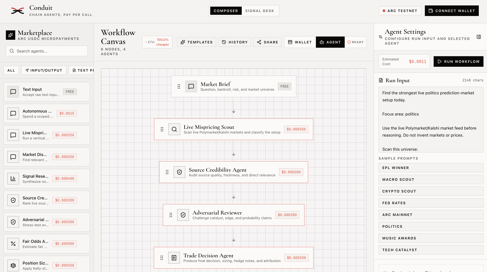
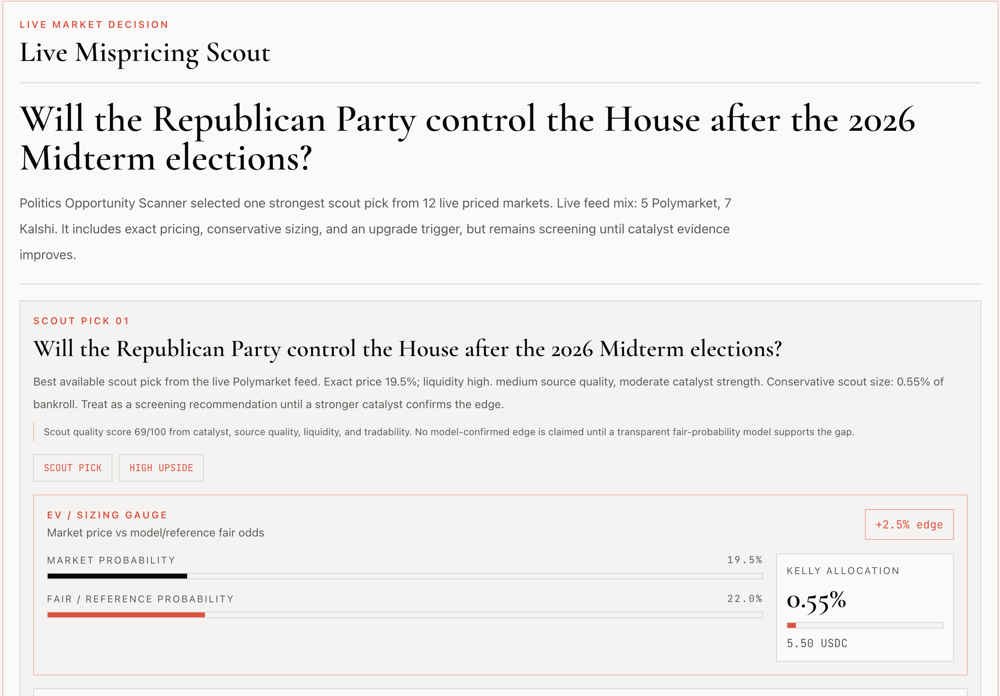
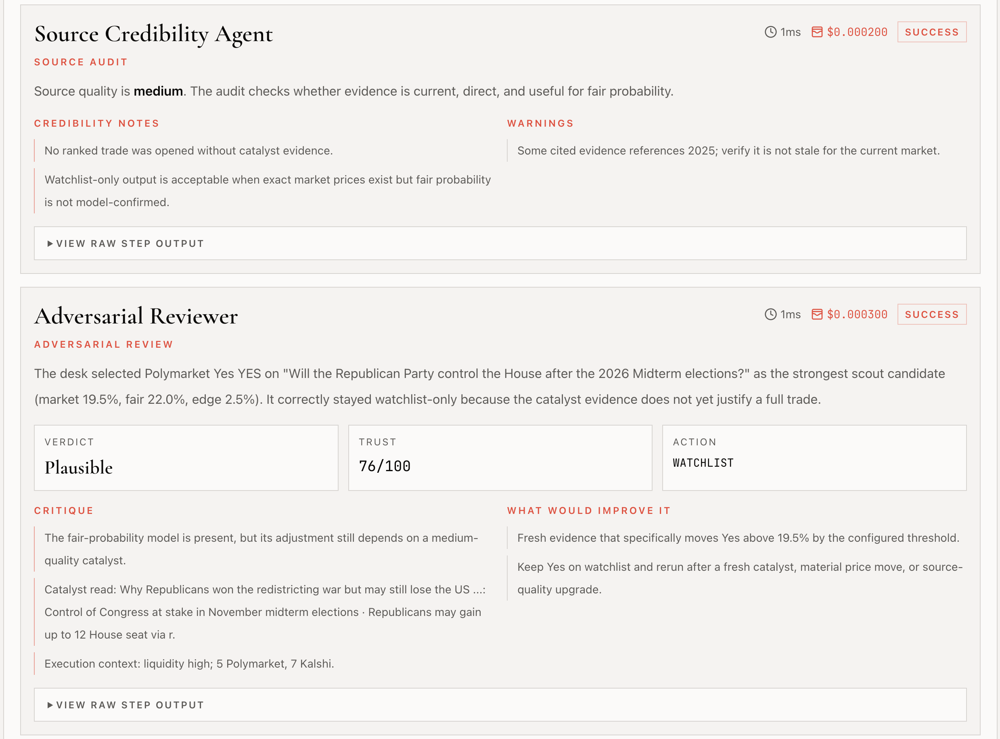

# Conduit

**Agent trader intelligence on Arc, settled in USDC**

Conduit is a paid agent research desk for prediction markets. It scans live Polymarket and Kalshi markets, researches catalysts, runs an adversarial review, sizes positions, and records Circle Agent Wallet settlement on Arc Testnet.

The product is built for the Agora Agents hackathon thesis: AI agents should not just automate workflows, they should make market decisions, explain them, manage risk, and pay for their own execution.

Today Conduit is strongest as:

- a **live market decision desk** for macro, crypto, sports, politics, entertainment, and technology markets
- a **paid multi-agent workflow** where each run produces a research result plus a Circle/Arc settlement receipt
- a **judge-friendly demo path** through `Agora Hackathon Demo` and `Signal Desk`

[Live app](https://arcconduit.vercel.app/)

  

## Demo

### Composer



### Live Market Decision



### Adversarial Review




## Features

- **Live Market Decision Desk** - Pulls live Polymarket and Kalshi candidates before agent reasoning
- **Prediction Market Trader Intelligence** - Signal research, source audit, fair-odds estimation, Kelly-style sizing, portfolio risk, and trade decisions
- **Adversarial Review** - A separate reviewer agent can downgrade weak trades to watchlist or pass
- **Arc USDC Payments** - Connected wallets or Circle Agent Wallets pay for the agent run before execution
- **Settlement-Backed Result Pages** - Successful runs open a dedicated result page with recommendation, sources, adversarial review, and Circle/Arc receipt data
- **Visual Workflow Composer** - Drag-and-drop interface to build and tweak agent pipelines
- **IPFS Storage** - Publish and share workflows permanently via Pinata/IPFS
- **Wallet Integration** - Connect MetaMask or WalletConnect to Arc Testnet
- **Pre-built Templates** - Includes the judge-facing `Agora Hackathon Demo` plus vertical market research workflows
- **Wallet-Aware History** - Track past executions with cost and performance metrics, merged with durable records for connected wallets
- **Durable Run Records** - Completed runs are stored in Upstash so `/app/runs/[runId]` links survive refreshes and other devices
- **Rate Limiting** - Upstash Redis-powered rate limiting to prevent abuse
- **Security** - Input sanitization, Zod validation, and server-side API key handling

## Tech Stack

- **Framework**: Next.js 16 (App Router)
- **Styling**: Tailwind CSS 4, shadcn/ui
- **AI**: Vercel AI SDK 6
- **Blockchain**: wagmi, viem, Arc Network Testnet
- **Payments**: Arc USDC ERC-20 transfer on Arc Testnet
- **Storage**: IPFS via Pinata
- **Run Storage / Rate Limiting**: Upstash Redis
- **Validation**: Zod

## Getting Started

```bash
git clone https://github.com/Ololadestephen/conduit.git
cd conduit
pnpm install
cp .env.example .env.local
pnpm dev
```

Open [http://localhost:3000](http://localhost:3000) to see the app.

### Config Summary

Conduit reads from `.env.local`. Use [`.env.example`](./.env.example) as the source of truth.

For the current demo, the important groups are:

- **AI provider**: `B_AI_*`
- **live research**: `TAVILY_API_KEY` or `SERPER_API_KEY`
- **durable runs / wallet-aware history**: `KV_REST_API_URL`, `KV_REST_API_TOKEN`
- **workflow sharing**: `PINATA_JWT`
- **Arc network**: `NEXT_PUBLIC_ARC_RPC_URL`, `ARC_USDC_ADDRESS`
- **Circle Agent Wallet mode**: `CIRCLE_API_KEY`, `CIRCLE_ENTITY_SECRET`, `CIRCLE_AGENT_WALLET_ID`, `CIRCLE_AGENT_WALLET_ADDRESS`

### Current Demo Flow

The fastest judge path is:

1. open `/app`
2. load **Agora Hackathon Demo** or go to `/app/signal-desk`
3. choose a focus area like macro, crypto, sports, or politics
4. run the paid desk with Connected Wallet or Circle Agent Wallet mode
5. inspect the result page for:
   - **Live Market Decision**
   - **Adversarial Review**
   - **Circle/Arc Settlement Receipt**
   - **Sources**

If `TAVILY_API_KEY` or `SERPER_API_KEY` is configured, the desk can enrich live
market candidates with current catalyst research before making a decision.

> Note: this is not full x402 settlement yet. The current milestone uses a direct
> Arc USDC ERC-20 transfer to make the payment/signing layer real while the app
> continues toward a later x402 facilitator integration.

### Circle Agent Wallet Execution

Agent Wallet mode pays from a Circle Developer-Controlled Wallet on
`ARC-TESTNET` without exposing Circle secrets to the browser.

Minimum setup:

```bash
npm install @circle-fin/developer-controlled-wallets@10.3.1 --legacy-peer-deps --no-audit --no-fund
npm run circle:agent-wallet
```

That flow generates/registers the entity secret, creates an `ARC-TESTNET`
wallet, and writes the wallet values back into `.env.local`.

Fund `CIRCLE_AGENT_WALLET_ADDRESS` with Arc Testnet USDC before running paid
agent workflows in Agent Wallet mode.

### Agora / Canteen Hackathon Setup

The Agora Agents hackathon uses the Canteen CLI for authenticated Arc RPC access
and project progress tracking.

```bash
uv tool install git+https://github.com/the-canteen-dev/ARC-cli.git
arc-canteen login
arc-canteen rpc eth_chainId
```

After login, print your RPC URL:

```bash
arc-canteen rpc-url
```

Paste that tokenized value into `NEXT_PUBLIC_ARC_RPC_URL` in `.env.local`. Do
not commit it.

## Arc Network

Conduit runs on Arc Testnet.

- **Chain ID**: `5042002`
- **Explorer**: [testnet.arcscan.app](https://testnet.arcscan.app)
- **Faucet**: [faucet.circle.com](https://faucet.circle.com/)

## Security

- All AI inputs are sanitized against prompt injection attacks
- API routes validate requests with Zod schemas
- Workflow execution records Arc USDC transfer metadata and links to ArcScan when available
- Rate limiting prevents abuse (10 workflows/min, 30 payments/min)
- Server-side only access to sensitive API keys


## License

MIT

## Links

- [Arc Network](https://arc.network)
- [Circle Developer Console](https://console.circle.com/)
- [Vercel AI SDK](https://sdk.vercel.ai)
